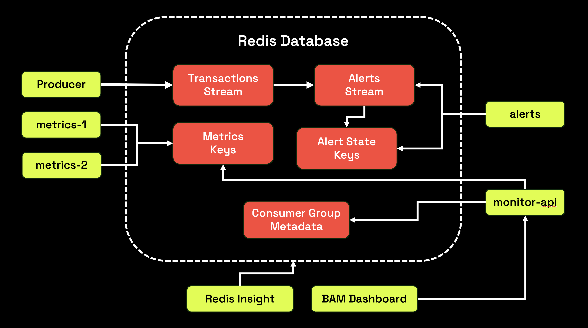

# Redis Streams EDA Demo

## Overview
This demo showcases how Redis Streams can power a compact event-driven workflow using a single Redis deployment and a small set of containerized services. Built with Java, Redis, Redis Insight, and a lightweight web dashboard, it demonstrates one source stream feeding multiple independent consumer groups, materialized analytics stored directly in Redis data structures, stateful alert generation into a derived stream, and live observability through a browser-based monitor. The goal is to make stream processing patterns easy to run, explain, and inspect on one machine.

## Table of Contents

* Demo Objectives
* Setup
* Running the Demo
* Slide Deck
* Architecture
* Known Issues
* Resources
* Maintainers
* License

## Demo Objectives

* Demonstrate Redis Streams as the source event stream for a multi-consumer workflow
* Show fan-out from one `transactions` stream to multiple independent consumer groups
* Highlight materialized analytics written directly into Redis data structures
* Illustrate stateful processing that emits a derived `alerts` stream
* Showcase lag, recovery, replay, and observability in one local demo

## Setup

### Dependencies

* Docker 24+
* Docker Compose v2
* A modern browser
* Enough Docker resources to run Redis, Redis Insight, and the Java services comfortably

### Configuration

#### Running the demo locally
This demo is self-contained and runs from the repository root using the provided `docker-compose.yml`. The Java services are built from the included `Dockerfile`, while the web dashboard is served separately from the `monitor-web` folder using Nginx. All services share a single Redis deployment so you can observe the stream, the derived stream, the consumer-group metadata, and the materialized analytics in one place.

To start the full stack, open a terminal in the repository root and run:

```bash
docker compose up --build
```

The first build compiles the Java application and assembles the container images, so it will take longer than subsequent runs.

#### Demo configuration knobs
This demo is configured through environment variables in `docker-compose.yml`. The most useful settings are:

* `PRODUCER_RATE_PER_SECOND`, which controls how fast the producer writes to `transactions`
* `METRICS_PROCESSING_DELAY_MS`, which adds a small delay to the metrics workers so lag and recovery remain visible during the demo
* `MONITOR_API_PORT`, which controls the internal HTTP port used by `monitor-api`

If you change any of these values, rebuild the stack with:

```bash
docker compose up --build
```

## Running the Demo

### Starting the full stack

1. Open a terminal and navigate to the repository root.

2. Start the demo:

```bash
docker compose up --build
```

This will:

* Start a Redis database on port `6379`
* Start Redis Insight on port `5540`
* Start a transaction producer that continuously writes to the `transactions` stream
* Start two metrics consumers in the `metrics-cg` consumer group
* Start an alert consumer in the `alerts-cg` consumer group
* Start the monitor API and the browser dashboard

3. Verify the containers are running:

```bash
docker compose ps
```

You should see the following services:

* `redis-database`
* `redis-insight`
* `producer`
* `metrics-1`
* `metrics-2`
* `alerts`
* `monitor-api`
* `monitor-web`

4. Access the demo surfaces in your browser:

* Redis Insight: `http://localhost:5540`
* Web dashboard: `http://localhost:8088`

Once the stack is up, the dashboard will begin polling the monitor API automatically and Redis Insight can be used to inspect streams and keys directly.

To stop the demo when you are finished, run:

```bash
docker compose down
```

### Observing the event flow
This demo starts with a single source stream named `transactions`. The producer continuously appends synthetic transaction events to that stream. From there, three independent consumer groups process the same data for different purposes:

* `metrics-cg` materializes analytics into Redis strings, sorted sets, and JSON values
* `alerts-cg` maintains rolling state and emits derived events into the `alerts` stream
* `monitor-cg` powers the live web dashboard and exposes a JSON snapshot through `monitor-api`

To inspect the flow directly, open Redis Insight and look at:

* Stream `transactions`
* Stream `alerts`
* Key `metrics:total_count`
* Key `metrics:total_volume`
* Key `metrics:high_risk_count`
* Key `metrics:volume_by_category`
* Key `metrics:count_by_region`

If you prefer command-line inspection, run the following from any Redis command runner:

```redis
XLEN transactions
XINFO STREAM transactions
XINFO GROUPS transactions
XRANGE transactions - + COUNT 5
XRANGE alerts - + COUNT 5
GET metrics:total_count
GET metrics:total_volume
GET metrics:high_risk_count
ZREVRANGE metrics:volume_by_category 0 -1 WITHSCORES
JSON.GET metrics:count_by_region
```

### Demonstrating lag and recovery
One of the main goals of this demo is to show that consumer groups can fall behind and recover independently while the producer continues to publish. The simplest way to show this is by stopping one metrics worker:

```bash
docker compose stop metrics-2
```

After a short pause, the dashboard should show fewer active metrics consumers and rising metrics lag. The `transactions` stream will keep growing because the producer is still running, and the remaining metrics worker will continue processing at a slower rate.

To bring the second worker back, run:

```bash
docker compose start metrics-2
```

The lag should begin draining and the dashboard should return to two metrics consumers.

If you want to show isolation between consumer groups, you can stop the monitor backend independently:

```bash
docker compose stop monitor-api
docker compose start monitor-api
```

This causes `monitor-cg` to fall behind temporarily while `metrics-cg` and `alerts-cg` continue processing without interruption.

## Architecture
At a high level, the architecture consists of one producer, three independent consumer groups, one derived stream, and a browser dashboard backed by a dedicated monitor API. Redis serves as the stream platform, the state store for alerts, the analytics store for metrics, and the metadata source for consumer-group observability.



## Known Issues

* Redis Insight may not connect automatically. If that happens, add `redis-database:6379` manually from the Redis Insight UI.
* The first `docker compose up --build` can take a bit longer because the Java application must be compiled and the images must be built.
* This is a demo workload with synthetic data and intentionally simplified operational behavior. It is designed to illustrate stream patterns, not to serve as a production reference architecture.
* If the web dashboard is not updating, inspect the monitor service logs with `docker compose logs --tail=100 monitor-api`.
* If metrics are not changing, inspect the worker logs with `docker compose logs --tail=100 metrics-1` and `docker compose logs --tail=100 metrics-2`.

## Resources

* `docker-compose.yml` for the service topology
* `src/main/java/io/redis/devrel/demo/eda/producer` for the transaction producer
* `src/main/java/io/redis/devrel/demo/eda/consumer` for the metrics and alerts consumers
* `src/main/java/io/redis/devrel/demo/eda/web` for the monitor API
* `monitor-web` for the browser dashboard

## Maintainers
* Ricardo Ferreira — [@riferrei](https://github.com/riferrei)

## License
This project is licensed under the MIT License. See the `LICENSE` file for details.
