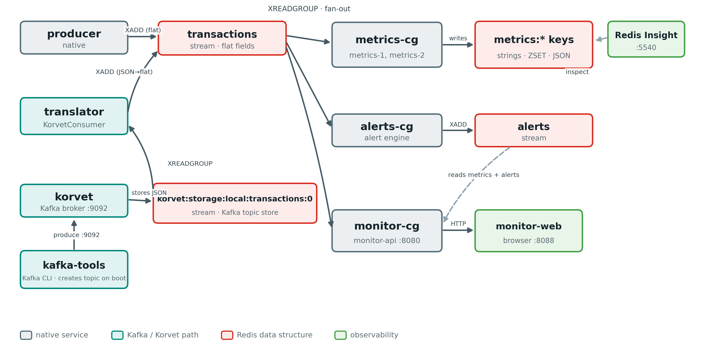

# Redis Streams EDA Demo

## Overview
This demo showcases how Redis Streams can power a compact event-driven workflow using a single Redis deployment and a small set of containerized services. Built with Java, Redis, Redis Insight, and a lightweight web dashboard, it demonstrates one source stream feeding multiple independent consumer groups, materialized analytics stored directly in Redis data structures, stateful alert generation into a derived stream, and live observability through a browser-based monitor. The goal is to make stream processing patterns easy to run, explain, and inspect on one machine.

## Table of Contents

* Demo Objectives
* Setup
* Running the Demo
* Architecture
* Known Issues
* Resources
* Maintainers
* License

## Demo Objectives

* Demonstrate Redis Streams as the source event stream for a multi-consumer workflow
* Show fan-out from one `transactions` stream to multiple independent consumer groups
* Highlight materialized analytics written directly into Redis data structures
* Illustrate stateful processing that emits a derived `alerts` stream
* Showcase lag, recovery, replay, and observability in one local demo
* Demonstrate that the same pipeline can be fed through the Kafka protocol using [Korvet](https://github.com/redis-field-engineering/korvet-dist), without changing the consumers

## Setup

### Dependencies

* Docker 24+
* Docker Compose v2
* A modern browser
* Enough Docker resources to run Redis, Redis Insight, and the Java services comfortably

### Configuration

#### Running the demo locally
This demo is self-contained and runs from the repository root using the provided `docker-compose.yml`. The Java services are built from the included `Dockerfile`, while the web dashboard is served separately from the `monitor-web` folder using Nginx. All services share a single Redis deployment so you can observe the stream, the derived stream, the consumer-group metadata, and the materialized analytics in one place.

To start the full stack, open a terminal in the repository root and run:

```bash
docker compose up --build
```

The first build compiles the Java application and assembles the container images, so it will take longer than subsequent runs.

#### Demo configuration knobs
This demo is configured through environment variables in `docker-compose.yml`. The most useful settings are:

* `PRODUCER_RATE_PER_SECOND`, which controls how fast the producer writes to `transactions`
* `METRICS_PROCESSING_DELAY_MS`, which adds a small delay to the metrics workers so lag and recovery remain visible during the demo
* `MONITOR_API_PORT`, which controls the internal HTTP port used by `monitor-api`

If you change any of these values, rebuild the stack with:

```bash
docker compose up --build
```

## Running the Demo

### Starting the full stack

1. Open a terminal and navigate to the repository root.

2. Start the demo:

```bash
docker compose up --build
```

This will:

* Start a Redis database on port `6379`
* Start Redis Insight on port `5540`
* Start Korvet, a Kafka-compatible broker backed by the same Redis, on port `9092`
* Start a `kafka-tools` container with the standard Kafka CLI tools
* Start `kafka-connect`, a Kafka Connect worker with the Redis sink connector that forwards events produced through the Kafka protocol into the native `transactions` stream
* Start `connect-init`, a one-shot container that registers the sink connector and then exits
* Start a transaction producer that continuously writes to the `transactions` stream
* Start two metrics consumers in the `metrics-cg` consumer group
* Start an alert consumer in the `alerts-cg` consumer group
* Start the monitor API and the browser dashboard

3. Verify the containers are running:

```bash
docker compose ps
```

You should see the following services:

* `redis-database`
* `redis-insight`
* `redis-korvet`
* `kafka-tools`
* `kafka-connect`
* `connect-init` (runs once, then exits — `docker compose ps -a` to see it)
* `producer`
* `metrics-1`
* `metrics-2`
* `alerts`
* `monitor-api`
* `monitor-web`

4. Access the demo surfaces in your browser:

* Redis Insight: `http://localhost:5540`
* Web dashboard: `http://localhost:8088`

Once the stack is up, the dashboard will begin polling the monitor API automatically and Redis Insight can be used to inspect streams and keys directly.

To stop the demo when you are finished, run:

```bash
docker compose down
```

### Observing the event flow
This demo starts with a single source stream named `transactions`. The producer continuously appends synthetic transaction events to that stream. From there, three independent consumer groups process the same data for different purposes:

* `metrics-cg` materializes analytics into Redis strings, sorted sets, and JSON values
* `alerts-cg` maintains rolling state and emits derived events into the `alerts` stream
* `monitor-cg` powers the live web dashboard and exposes a JSON snapshot through `monitor-api`

The native pipeline owns an ordinary Redis Stream named `transactions`. The producer appends synthetic events there, and each entry stores the event as discrete fields (`txn_id`, `amount`, `category`, `region`, `risk_score`, `timestamp`). The consumers never reference Korvet; they just read `transactions`.

Events produced through the Kafka protocol are merged in by **Kafka Connect** running the [Redis sink connector](https://github.com/redis-field-engineering/redis-kafka-connect). The sink consumes the `transactions` Kafka topic from Korvet and `XADD`s each record into the native `transactions` stream. Two in-pipeline transformations do the adaptation the native consumers need: a `ReplaceField` SMT renames `txnId`/`riskScore` to `txn_id`/`risk_score`, an `InsertField` SMT stamps the record timestamp, and `redis.type=STREAM` writes the JSON value out as discrete stream fields. This keeps the native producer and consumers Korvet-agnostic — the only Kafka/Korvet-aware piece is connector configuration, no custom code.

To inspect the flow directly, open Redis Insight and look at:

* Stream `transactions` (the native event log the consumers read)
* Stream `korvet:storage:local:transactions:0` (Korvet's store for the Kafka topic; the source the sink connector consumes)
* Stream `alerts`
* Key `metrics:total_count`
* Key `metrics:total_volume`
* Key `metrics:high_risk_count`
* Key `metrics:volume_by_category`
* Key `metrics:count_by_region`

If you prefer command-line inspection, run the following from any Redis command runner:

```redis
XLEN transactions
XINFO STREAM transactions
XINFO GROUPS transactions
XRANGE transactions - + COUNT 5
XRANGE alerts - + COUNT 5
GET metrics:total_count
GET metrics:total_volume
GET metrics:high_risk_count
ZREVRANGE metrics:volume_by_category 0 -1 WITHSCORES
JSON.GET metrics:count_by_region
```

### Demonstrating lag and recovery
One of the main goals of this demo is to show that consumer groups can fall behind and recover independently while the producer continues to publish. The simplest way to show this is by stopping one metrics worker:

```bash
docker compose stop metrics-2
```

After a short pause, the dashboard should show fewer active metrics consumers and rising metrics lag. The `transactions` stream will keep growing because the producer is still running, and the remaining metrics worker will continue processing at a slower rate.

To bring the second worker back, run:

```bash
docker compose start metrics-2
```

The lag should begin draining and the dashboard should return to two metrics consumers.

If you want to show isolation between consumer groups, you can stop the monitor backend independently:

```bash
docker compose stop monitor-api
docker compose start monitor-api
```

This causes `monitor-cg` to fall behind temporarily while `metrics-cg` and `alerts-cg` continue processing without interruption.

### Sending events through the Kafka protocol (Korvet)
The whole demo so far has been pure Redis Streams: a native producer appends to the `transactions` stream, and native consumer groups read from it. The final act shows that the very same pipeline can be fed through the Kafka protocol instead, with no changes to the consumers or the dashboard.

This works because [Korvet](https://github.com/redis-field-engineering/korvet-dist) is a Kafka-compatible broker that stores each Kafka topic partition as a Redis Stream, and **Kafka Connect** (with the [Redis sink connector](https://github.com/redis-field-engineering/redis-kafka-connect)) moves those records into the native `transactions` stream. The `kafka-connect` worker runs the sink connector — registered once by `connect-init` — which consumes the `transactions` topic from Korvet and `XADD`s each record into the `transactions` Redis stream. The connector's JSON converter plus a `ReplaceField` and an `InsertField` SMT turn the Kafka record into the exact discrete fields the native consumers expect, so a Kafka-produced event arrives in the pipeline identical in shape to what the native producer writes — with no custom glue code.

First, stop the native producer so the only new events are the ones you send via Kafka:

```bash
docker compose stop producer
```

The `transactions` topic does not need to be created by hand. The `redis-korvet` service is configured to auto-create it with a single partition (`KORVET_TOPICS_0_*` in `docker-compose.yml`). Korvet creates topics **lazily** — on the first produce, not at server startup — so listing topics before you produce shows nothing; that is expected, not a failure. The single partition guarantees every message lands in partition `0` (`korvet:storage:local:transactions:0`), the stream the sink connector consumes.

Produce events with the standard Kafka console producer and watch the dashboard at `http://localhost:8088` update — the first produce creates the topic, and the metrics, alerts, and recent-transaction views all advance from Kafka-sent data:

```bash
docker compose exec kafka-tools /opt/kafka/bin/kafka-console-producer.sh \
  --bootstrap-server redis-korvet:9092 \
  --topic transactions \
  --command-property enable.idempotence=false
```

Then paste one JSON event per line (press Enter after each). Use the demo's own categories (`payroll`, `wire`, `pos`, `ach`, `internal`) and regions (`northeast`, `southeast`, `west`, `midwest`) so the analytics and alerts react as expected:

```json
{"txnId":"TXN-kafka01","amount":48500.00,"category":"wire","region":"southeast","riskScore":93}
{"txnId":"TXN-kafka02","amount":250.00,"category":"pos","region":"west","riskScore":12}
{"txnId":"TXN-kafka03","amount":15750.00,"category":"internal","region":"northeast","riskScore":88}
```

You can omit the `timestamp` field — the `InsertField` SMT stamps each record with its Kafka record timestamp, so the `transactions` entry always carries one. A `riskScore` above `80` counts as high risk, so the first and third events above increment the high-risk metric.

Once you have produced at least one event, the topic exists — confirm it (and its single partition) with:

```bash
docker compose exec kafka-tools /opt/kafka/bin/kafka-topics.sh \
  --bootstrap-server redis-korvet:9092 --describe --topic transactions
```

To confirm the Kafka path, inspect both streams. Korvet's stream holds what you produced over Kafka; the native `transactions` stream holds the records the sink connector forwarded (one per event):

```bash
docker compose exec redis-database redis-cli XRANGE korvet:storage:local:transactions:0 - + COUNT 5
docker compose exec redis-database redis-cli XREVRANGE transactions + - COUNT 5
```

Korvet's stream shows a single `value` field holding the JSON you sent; the `transactions` entries show the discrete fields (`txn_id`, `amount`, `category`, …) the connector produced from it. Entries in `transactions` carry their own stream entry IDs (the sink appends them), which is expected — the connector copies records rather than sharing the physical entry, the price of keeping the two systems decoupled. You can also watch the connector work: `docker compose logs --tail=20 kafka-connect`.

> A note on readability: Korvet compresses the stored `value` with LZ4 by default. This demo sets `KORVET_STORAGE_LOCAL_COMPRESSION_CODEC=none` on the `redis-korvet` service so the value stays plain JSON you can read directly in Redis Insight. (The connector itself doesn't depend on this — Kafka clients receive decompressed data over the protocol regardless.)

## Architecture
At a high level, the architecture consists of one producer, three independent consumer groups, one derived stream, and a browser dashboard backed by a dedicated monitor API. Redis serves as the stream platform, the state store for alerts, the analytics store for metrics, and the metadata source for consumer-group observability. The native producer and consumers work entirely against the demo's own `transactions` stream and have no knowledge of Korvet.

Alongside these, Korvet runs as a Kafka-compatible broker over the same Redis, so the event log can also be fed through the Kafka protocol. Korvet stores Kafka topics in its own keyspace; **Kafka Connect** with the [Redis sink connector](https://github.com/redis-field-engineering/redis-kafka-connect) consumes the `transactions` topic and writes each record into the demo's `transactions` stream, with SMTs adapting the field names and the `STREAM` type exploding the JSON value into discrete fields. Connect is the single point of contact between the two worlds — standard, configuration-only tooling rather than custom code — which keeps the native pipeline decoupled from Korvet's internal storage layout. The trade-off is that forwarded events are copies (new entry IDs) rather than the same physical Redis entry.



## Known Issues

* Redis Insight may not connect automatically. If that happens, add `redis-database:6379` manually from the Redis Insight UI.
* The first `docker compose up --build` can take a bit longer because the Java application must be compiled and the images must be built.
* This is a demo workload with synthetic data and intentionally simplified operational behavior. It is designed to illustrate stream patterns, not to serve as a production reference architecture.
* If the web dashboard is not updating, inspect the monitor service logs with `docker compose logs --tail=100 monitor-api`.
* If metrics are not changing, inspect the worker logs with `docker compose logs --tail=100 metrics-1` and `docker compose logs --tail=100 metrics-2`.
* If Kafka-produced events do not reach the dashboard, check that the sink connector registered and is running: `curl -s http://localhost:8083/connectors/redis-transactions-sink/status` (or `docker compose logs --tail=100 kafka-connect`). Also confirm `connect-init` exited 0 (`docker compose ps -a`) and that the `transactions` topic has one partition (`kafka-topics.sh --describe`).

## Resources

* `docker-compose.yml` for the service topology
* `src/main/java/io/redis/devrel/demo/eda/producer` for the transaction producer
* `src/main/java/io/redis/devrel/demo/eda/consumer` for the metrics and alerts consumers
* `src/main/java/io/redis/devrel/demo/eda/web` for the monitor API
* [redis-kafka-connect](https://github.com/redis-field-engineering/redis-kafka-connect) for the Redis Kafka Connect sink connector, configured under the `kafka-connect` / `connect-init` services in `docker-compose.yml`
* `monitor-web` for the browser dashboard
* [Korvet](https://github.com/redis-field-engineering/korvet-dist) for the Kafka-compatible broker backed by Redis Streams, and its [Kafka CLI sample](https://github.com/redis-field-engineering/korvet-dist/tree/main/samples/kafka-cli)

## Maintainers
* Ricardo Ferreira — [@riferrei](https://github.com/riferrei)

## License
This project is licensed under the MIT License. See the `LICENSE` file for details.
